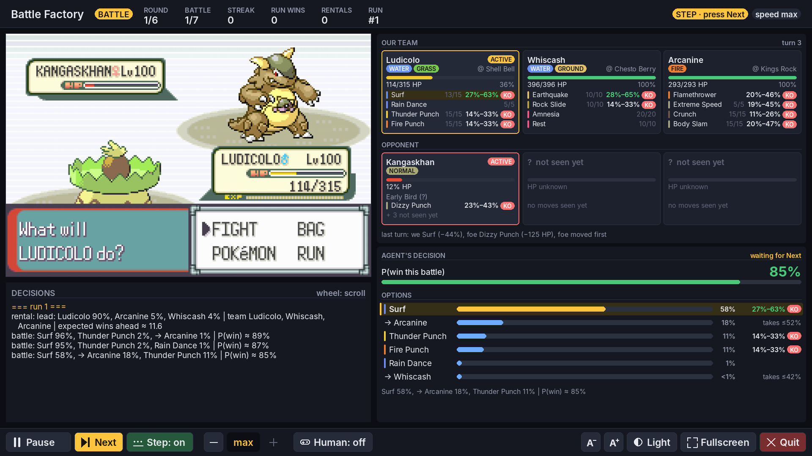

# pybattlefactory — the guide

This explains what the project is, how the pieces fit together, and how to run everything.
It is written to be read top to bottom once, then used as a reference.

---

## 1. What this is, in one paragraph

You want agents that beat the **Battle Factory** in Pokémon Emerald. Training needs millions of
games, which is far too slow on a real emulator. So this project has two versions of the same game:

- A **simulator**. It is fast (about 1,000 Factory battles per second), has no graphics, and is used
  for training.
- The **real game**, running in an emulator. It is used for testing and for watching.

Both look exactly the same to an agent: same information, same actions. An agent trained on the
simulator can therefore be dropped onto the real game unchanged.

---

## 2. Why you can trust the simulator

The simulator is not a re-creation of Pokémon rules written by hand. It **is** the game's own code.

- The Pokémon Emerald decompilation (`~/Dev/pokeemerald`) is the original game's source code.
  This project copies its battle engine, battle AI, Battle Factory logic and Pokémon logic into
  `third_party/pokeemerald/`.
- It then compiles that code for your computer instead of for the Game Boy Advance. Graphics,
  sound and text boxes are replaced by "do nothing" stand-ins.
- Battle scripts (the small programs that describe what every move does) are taken byte for byte
  from the ROM.

To prove it matches, battles were played on the real ROM in an emulator and recorded. Each
recording was then replayed in the simulator, which had to reproduce **every byte of battle memory
and the random number generator** at every decision. It does: 42 real battles, around 1,100
decisions, zero differences. That covers early and late streaks, every difficulty of the enemy AI,
and the Factory Head (Noland).

The one thing that cannot match exactly: on the real game, the random numbers also move while you
walk around between battles (every frame advances them). So the specific rentals and opponents you
get differ between the simulator and the emulator. The *rules* that produce them are identical,
checked 6 out of 6 times.

---

## 3. The pieces

```
                ┌──────────── your agents (you write these) ────────────┐
                │   tactician: rentals + swaps    battler: moves/switches│
                └───────────────────────┬───────────────────────────────┘
                                        │  view → action
                     ┌──────────────────┴──────────────────┐
                     │   the "backend" interface           │   pybattle/backend.py
                     │   reset() · view() · act() · phase  │
                     └─────────┬───────────────────┬───────┘
                               │                   │
                 SimBackend (fast, training)   EmuBackend (real ROM)
                 game code, headless           headless mGBA, or the viewer window,
                 src/gen3/ + third_party/      or mgba-qt through a Lua script
```

| What | Where |
|---|---|
| The game's code, copied from the decompilation | `third_party/pokeemerald/` (generated, don't edit) |
| Glue that runs it without a Game Boy | `src/gen3/host.c` |
| A full Factory run (rentals → battles → swaps → …) | `src/gen3/factory_run.c` |
| The interface your agents use | `pybattle/backend.py`, `pybattle/agent.py` |
| What an agent is allowed to see | `pybattle/view.py` |
| Real game: emulator control | `pybattle/emu/driver.py`, `pybattle/emu_backend.py` |
| The watch window | `pybattle/emu/viewer.py`, `pybattle/emu/ui.py`, `scripts/watch.py` |
| Example agents (random) | `examples/random_agents.py` |
| Tests | `tests/python/` |

---

## 4. Setup (once)

You need Linux, Python 3.12, CMake and a C++ compiler.

```bash
cd ~/Dev/pybattlefactory
pip install numpy gymnasium pyelftools pytest pillow pygame
cmake -S . -B build -DCMAKE_BUILD_TYPE=Release
cmake --build build -j
```

The build downloads two things by itself:
- **pybind11**, which connects C++ to Python;
- a small copy of the **mGBA** emulator, with no windows, used for the real game.

The resulting Python modules are placed inside `pybattle/`.

Check that everything works:

```bash
python -m pytest tests/python
```

All tests should pass (one is marked "expected to fail"; it belongs to the old engine).

Your ROM and save are at:

```
/home/apollo/Desktop/Dev/pokemon-battle-factory/roms/Pokemon - Emerald Version (USA, Europe).gba
/home/apollo/Desktop/Dev/pokemon-battle-factory/roms/Pokemon - Emerald Version (USA, Europe).sav
```

The save loads with the player standing in the Battle Factory lobby. Your `.sav` file is never
modified: all saving happens in memory.

---

## 5. Watch agents play the real game

```bash
ROMS="/home/apollo/Desktop/Dev/pokemon-battle-factory/roms"
python scripts/watch.py --rom "$ROMS/Pokemon - Emerald Version (USA, Europe).gba" \
                        --save "$ROMS/Pokemon - Emerald Version (USA, Europe).sav"
```

What happens, all by itself:

1. The save loads from the title screen (it presses CONTINUE).
2. The player walks to the singles attendant.
3. It takes the challenge at **Open Level** (level 100).
4. The tactician picks 3 of the 6 rental Pokémon.
5. The battler fights, choosing moves, switches and replacements after a faint.
6. After each win, the tactician decides whether to swap a Pokémon for one from the beaten team.
7. After 7 wins, the challenge is complete and a new one starts. The win streak keeps growing.
8. When a battle is lost, the game sends the player back to the lobby, and it all starts again.

This loops until you close the window.

**The window.**



Resize it, maximize it or click **Fullscreen**: everything follows the window size (from about
1280×720 up to 4K), and **A−** / **A+** make the text smaller or bigger. If a panel doesn't fit,
its text shrinks a little instead of being cut off.

- **Header** (top): the phase (RENTAL, BATTLE, FORCED SWITCH, SWAP), the round (a block of 7
  battles), the battle number *n*/7 (with a **NOLAND** badge on battles 21 and 42), the win
  streak, the wins in this run, the Factory's rental counter, the run number, and on the right the
  mode (AGENTS / STEP / HUMAN) and the speed.
- **Game screen** (left) with the **decision log** below it: every decision and battle result, also
  saved to `watch_log.jsonl`. Scroll it with the mouse wheel; scroll back down to follow it again.
- **What the agent sees** (top right):
  - *battle*: our three Pokémon as cards (HP bar with the game's green/yellow/red, status, item,
    the four moves in their type colours with PP) and the opponent's three (species or "not seen
    yet", HP from its 48-pixel bar, status, the ability or its possible abilities, the moves it has
    revealed). The active ones come first and are outlined. Next to each move is the estimated
    damage against the opponent's active Pokémon, as a min–max % of its HP, with **KO** when it
    can knock it out now (from `rl/damage.py`); next to the opponent's revealed moves, the same
    against ours. Under each team are chips for stat stages (Atk +1…), volatile states
    (Confused, Substitute…) and screens / Spikes; then the weather and a summary of the last turn;
  - *rental*: the six candidates with their stats, ability and moves. The three taken are marked
    **LEAD**, **#2** and **#3**, and each card shows the agent's lead probability;
  - *swap*: our team (the one leaving is marked **OUT**), and the beaten team with what we saw of
    it (the one coming in is marked **IN**), plus the hint about the next opponent.
- **The agent's decision** (bottom right): the battler's **P(win)** for this battle, or the
  tactician's **expected wins ahead**. Below that, every legal option as a probability bar, most
  likely first, with the chosen one highlighted. Moves also show the damage estimate, and switches
  show the most damage the new Pokémon could take from the moves seen so far. For rentals there
  are the lead probabilities and then the best partner pairs for that lead; for swaps, "keep" and
  each possible trade (options under 1% are folded into one line). The agent's full reason line
  is at the bottom. An agent that gives only a reason string, like the random dummies, still gets
  every panel: the options are listed and the chosen one is marked, just without probabilities.
  To fill these panels from your own agent, return `Choice(action, reason, details)`; the keys are
  documented in `pybattle/agent.py` (`rl/agents.py` is a complete example).

**Controls.** Every control is a button along the bottom. Hover and pressed states show which one
you're on:

| Button | What it does |
|---|---|
| Pause / Resume | pause or resume the game |
| Next | step mode: do the action shown in the panel (highlighted only while the agent is waiting) |
| Step: on / off | step mode: the agent shows its choice and waits for **Next** before doing it |
| `−` · speed · `+` | slower / faster; the middle box shows the current speed (1×, 2×, 4×, 8×, max). It changes at once |
| Human: on / off | human mode (see below) |
| A− / A+ | smaller / bigger text |
| Light / Dark | switch between the light and dark themes |
| Fullscreen / Window | go fullscreen or back to the window |
| Quit | close the window (the window's ✕ does the same) |

On a narrow window, the buttons show only their icons.

The window stays responsive at every speed, while the agent is thinking and while it waits in step
mode: the game and the agents run in a separate thread, and the window handles clicks 60 times a
second. Outside human mode a few keys also work as shortcuts (Space pause, `+`/`-` speed,
Enter/N next, F11 fullscreen), but you never need them.

Useful options: `--speed 4` starts faster (`0` = max), `--step` starts in step mode, `--human`
starts in human mode, `--size 1920x1080` sets the window size, and `--theme light` starts in the
light theme.

### Human mode: you play, the agents comment

Click **Human: off** so it reads **Human: on** (or start with `--human`). Now the keyboard controls
the game — and only the game; in human mode no key does anything else:

| Keyboard | GBA button |
|---|---|
| arrows | D-pad |
| Z | A |
| X | B |
| Enter | Start |
| Backspace | Select |
| A | L |
| S | R |

The key map is also shown over the bottom of the game screen while human mode is on. (The window
must have keyboard focus: click on it once.) Each time you reach a decision (the rental screen,
"What will X do?", a swap question, choosing a replacement), the same panels show what the agents
**would** do in your place. Click **Human: on** again while standing at a decision and the agents
take over from there.

### Watch in the real mgba-qt instead (optional, untested)

1. Open the ROM and save in mgba-qt.
2. Go to *Tools → Scripting → File → Load script* and choose `emu/mgba/bridge.lua`.
3. In Python, use `EmuBackend(machine=LuaMachine())`, with `from pybattle.emu import LuaMachine`.

The built-in window above is the tested path.

---

## 6. How an agent talks to the game

Every run is a sequence of **decisions**. At each one, the backend tells you which kind of decision
it is (the **phase**), gives you a **view** of what the player can see, and waits for an **action**.

| Phase | When | View | Action you return |
|---|---|---|---|
| `RENTAL` | start of each challenge | `RentalView` | `(a, b, c)`: three rental slots 0–5. The order is the party order, and the first one leads. |
| `BATTLE` | "What will X do?" | `BattleView` | `("move", 0-3)`, `("switch", party_index)` or `("forfeit",)` |
| `FORCED_SWITCH` | you must send a Pokémon in: yours fainted, or you used Baton Pass | `BattleView` | `("switch", party_index)` |
| `SWAP` | after each win (not after the 7th) | `SwapView` | `None` to keep the team, or `(my_slot, their_slot)` to trade |
| `RUN_OVER` | a battle was lost | — | — |

Every `BattleView` also lists the exact actions the backend accepts right now in `legal_actions`
(and `must_struggle` says when the only move left is Struggle, answered with `("move", 0)`).

The smallest possible program, on the fast simulator:

```python
from pybattle.backend import SimBackend, Phase

game = SimBackend()
game.reset(seed=1)                # start a run (win_streak=... to start deeper)
while game.phase != Phase.RUN_OVER:
    view = game.view()
    action = ...                  # your agent decides here
    game.act(action)
print("battles won:", game.wins)
```

The same loop works with `EmuBackend(rom, save)` on the real game.

**Writing an agent for the watch window.** Make a class with a method
`act(phase, view, run_info)` that returns `Choice(action, "a short reason")`. `Choice` comes from
`pybattle/agent.py`. Look at `examples/random_agents.py` for a complete example of both agents. Run
yours with:

```bash
python scripts/watch.py --rom ... --save ... --agents mymodule:MyTactician,mymodule:MyBattler
```

**Useful extras**

- `game.run_info()`: the win streak, the battle number inside the challenge (0–6), the challenge
  number, and wins so far.
- `game.last_battle_won`: whether the most recent battle was won.
- `SimBackend.clone()`: an independent copy of the whole game at this moment. Useful for trying
  "what if I did X" without touching the real run.
- Seeds: `reset(seed=...)` makes a simulator run repeatable.
- Gen 3 battles have no turn limit, and two Pokémon can stall forever (for example, both only
  healing). `SimBackend(max_turns=500)` forfeits after that many turns. The random battler forfeits
  after 300 turns by itself.

---

## 7. What the agent can see

The views contain exactly what a human player could know: what is on screen, what the battle
messages said, a perfect memory of the battle so far, and knowledge of the game itself (species
data, move data, how long the fixed-length effects last). Never more: the real game won't tell you
more than that, so neither does the simulator.

Both backends build the views with the same code (`pybattle/view.py`, class `BattleObserver`)
from the same game RAM. Some hidden values (the opponent's exact HP, ability, Speed, sleep
counter...) are read internally, but only to work out what the player just *watched* (who moved
first, which ability was announced, how far the HP bar dropped). Only those visible results end up
in a view. `tests/python/test_view_backends.py` plays battles on the real ROM and checks that the
simulator produces the same views, field for field.

**`RentalView`** (the rental screen; in the game you can open each Pokémon's summary)
- The 6 rentals, with everything: species, level, HP, stats, moves, PP, held item, ability,
  nature, IVs, EVs, types.
- `hint_type`, `hint_style`: what the attendant says about your first opponent ("They seem to like
  Water-type Pokémon", "a high-risk style"…). `hint_type` 18 means no hint.
- `frontier_ids`: which of the game's 882 Factory Pokémon sets each rental is.

**`BattleView`** (during a battle)

*Your three Pokémon* (`own_party`, `OwnMon`): everything the summary screen shows: HP, stats,
moves, PP, item, ability, nature, IVs, EVs, types, status. `sleep_turns`: while asleep, how many
times it has tried to move so far (see the counters below).

*The opponent's three Pokémon* (`enemy_party`, `SeenMon`, by party slot):
- A Pokémon **never sent out reveals nothing** (`seen` False): species 0, level 0,
  `hp_pixels` -1, status 0, empty lists. That there are three of them is visible (the party balls).
- Once seen: `species`, `level`; game knowledge about the species: `types`, `base_stats`
  (HP Atk Def Spe SpA SpD), `possible_abilities` (the one or two abilities the species can have).
- `hp_pixels`: the **HP bar**, 0–48 pixels (roughly a percentage), never the exact HP. A benched
  Pokémon keeps the bar it had when it left.
- `status`: burn, sleep, etc., as last seen on the field (a Pokémon with Natural Cure is cured
  silently when it leaves, so the view keeps what the player saw).
- `revealed_moves`: moves **seen being used**.
- `revealed_item`: only once the game named it: eaten berries and other consumed items,
  Knock Off / Thief / Trick, Leftovers ("restored a little HP using its Leftovers").
- `revealed_ability`: only once the game **announced** it (0 until then). Detected: Intimidate
  (also when stopped by Clear Body…), Trace, Water Absorb / Volt Absorb / Flash Fire absorbing our
  move, Static / Flame Body / Poison Point / Effect Spore giving us a status after contact,
  Synchronize, Limber / Immunity / Own Tempo / Water Veil / Insomnia / Vital Spirit / Oblivious /
  Suction Cups / Damp / Sturdy (vs. one-hit KO) / Clear Body / White Smoke / Hyper Cutter /
  Keen Eye stopping our move, Liquid Ooze, Sticky Hold, Inner Focus (vs. Fake Out), Speed Boost,
  Shed Skin, and Shadow Tag / Arena Trap / Magnet Pull when they keep us from switching (the game
  names the ability as soon as you try). Species with a single ability are already known from
  `possible_abilities`.
- `fainted`, `sleep_turns` (times seen trying to move while asleep).

*The two Pokémon on the field* (`own_active`, `enemy_active`, `ActiveState`): party slot, stat
changes (+1 Attack…, announced), current types, and every visible effect: confusion, infatuation,
Substitute, Leech Seed, Curse, Nightmare, trapped (Mean Look/Block), Focus Energy, Transform,
Perish Song, Ingrain, Yawn, Torment, Taunt, Encore / Disable (the move), consecutive Protects,
Destiny Bond, Defense Curl, Foresight, Minimize, Charge, Imprison, Grudge, Mud/Water Sport, Rage,
`first_turn` (it came in last turn: Fake Out works), `locked_move` (Outrage, Uproar, Rollout,
Bide, a charging move, Hyper Beam's recharge), `charging_move` (first turn of Solar Beam, Fly,
Dig, Dive, Bounce… done), `semi_invulnerable` (in the air / underground / underwater),
`must_recharge`.

*Turn counters.* The rule: an effect whose length is fixed by the game may show the turns left;
an effect of random length shows only the turns elapsed (the player can count those, not the
dice); anything the game displays is shown. "Turns left" counts the end-of-turns before it ends
(Reflect used this turn shows 4 at the next decision). "Elapsed" of an end-of-turn effect counts
completed turns since it started (1 at the first decision after the turn it began).

| Field | Kind | Why |
|---|---|---|
| `sleep_turns` (per Pokémon, both sides) | elapsed: attempts to move while asleep | sleep lasts 2–5 attempts, random |
| `confusion_turns` | elapsed: attempts while confused | 2–5, random |
| `toxic_counter` | known | Toxic damage grows by 1/16 each turn on the field: deterministic |
| `perish_count` | displayed | "perish count fell to N" (-1 = none, 0 = faints this turn) |
| `taunt_turns_left` | left | fixed (2) |
| `encore_turns` | elapsed | 3–6, random |
| `disable_turns` | elapsed | 2–5, random |
| `yawn_turns_left` | left | fixed: falls asleep at the end of the next turn |
| `wrapped_turns` (Wrap, Bind, Fire Spin, Clamp, Whirlpool, Sand Tomb on it) | elapsed | 3–6, random |
| `uproar_turns` | elapsed | 2–5, random |
| `rampage_turns` (Outrage, Thrash, Petal Dance) | elapsed | 2–3, random |
| `bide_turns_left` | left | fixed (2) |
| `rollout_hits_left` (Rollout, Ice Ball) | left | fixed 5-hit sequence |
| `fury_cutter_count`, `stockpile` | known / displayed | counted from the messages |
| `charge_turns_left` | left | fixed |
| `locked_on_turns_left` | left | the foe's Lock-On / Mind Reader: its next move surely hits this Pokémon (fixed) |
| `substitute_hp` | ours only | you know your own Substitute's HP; the opponent's shows -1 |
| `own_side` / `enemy_side` (`SideState`): `reflect_turns`, `light_screen_turns`, `safeguard_turns`, `mist_turns` | left | fixed (5) |
| `spikes` | known | layers laid |
| `future_sight_turns` (+ `future_sight_move`: Future Sight / Doom Desire) | left | fixed (3) |
| `wish_turns` | left | fixed (2) |
| `weather` (none / rain / sun / sandstorm / hail), `weather_permanent`, `weather_turns_left` | left | a move's weather lasts 5 turns; an ability's (Drizzle, Drought, Sand Stream) lasts until replaced: `weather_permanent`, no count |

*Last turn* (`last_turn`, `TurnEvents`): what happened in the most recent turn, as watched.
- At a `BATTLE` decision it is the turn that just ended. At a `FORCED_SWITCH` decision it is the
  turn in progress: after a faint the whole turn is over (including end-of-turn effects); after
  your Baton Pass it is not (`in_progress` True). On the first decision of a battle `turn` is -1
  and everything is empty. When the game skipped your decisions (locked into Outrage, recharging,
  charging Fly…), `turns` > 1 and the events cover all those turns.
- `first`: which side acted first (0 you, 1 opponent, -1 unknown: a speed tie decided by the RNG,
  or nobody acted). Switches go before moves.
- `own_action` / `enemy_action`: none (did nothing: fainted before its turn, or dragged out by
  Roar), move, switch (voluntary), cant_move (asleep, frozen, fully paralyzed, flinched,
  recharging, hurt itself in confusion…). `own_move` / `enemy_move`: the move used ("X used Y!"),
  0 otherwise. A Pokémon that could not move does not reveal what it had chosen.
- `own_crit` / `enemy_crit`: 1 critical hit, 0 no, -1 unknown. See the limits below.
- `damage_dealt_pixels`: how far the opponent's HP bar dropped under your hits this turn.
  `damage_taken`: exact HP your Pokémon lost to the opponent's hits (you know your own HP).
  Neither includes end-of-turn effects (weather, poison, Leech Seed…), recoil, or HP paid for
  Substitute / Belly Drum / Curse.
- `own_fainted`, `enemy_fainted`.

*Opponent hints*: `hint_type`, `hint_style`: what the attendant said about this opponent before
the battle.

*Weather and turn number*: see the table; `turn` is the game's turn counter (starts at 0, stops
at 255).

*What you may do* (see also section 6):
- `usable_moves`: which of your 4 moves the game will accept right now. The game refuses moves
  with no PP, Disabled, Taunted, Tormented, Imprisoned, Encored or Choice-locked ones.
- `switch_targets`: which Pokémon you may switch to. This is empty while you are trapped by Mean
  Look, a wrap move, Ingrain, Shadow Tag, Arena Trap or Magnet Pull.
- `must_struggle`: every move is blocked, so the game will use **Struggle**.
- `legal_actions`: every action the backend accepts right now, e.g.
  `[("move", 0), ("move", 2), ("switch", 1), ("forfeit",)]`. With `must_struggle` the only move
  action is `("move", 0)`.

**`SwapView`** (after a win)
- Your team, fully.
- The team you just beat: **species**, because that's what the swap screen shows (plus the
  species' types, base stats and possible abilities), and whatever the battle revealed: moves,
  item, ability.
- The hints about your **next** opponent (the game gives them before asking about the swap).

**`RunInfo`**: the streak and battle numbers above.

**Out of PP: Struggle.** When none of your moves can be used (no PP left, or the rest are
blocked), `usable_moves` is all `False` and `must_struggle` is `True`. Answer `("move", 0)`: like
pressing FIGHT in the game, which then says "X has no moves left!" and uses **Struggle**. With your
last Pokémon standing there is nothing else to do (`switch_targets` is empty), so `legal_actions`
is `[("move", 0), ("forfeit",)]`. This is common in long random battles. If you pick a move the
game refuses (e.g. one with 0 PP while others still have PP), nothing happens that turn: you
simply get the same decision again.

**Turns you are not asked about.** While your Pokémon is locked into a move (Outrage, Thrash,
Petal Dance, Uproar, Rollout, Bide, the second turn of Solar Beam / Fly / Dig…) or must recharge
after Hyper Beam, the game does not ask anything; the turn just happens. Your next decision's
`last_turn.turns` says how many turns went by.

**Switches you don't choose.** When the opponent uses **Roar** or **Whirlwind** on you, the game
picks your replacement **at random**; you are never asked, so there is no decision for the agent.
The same happens to the opponent when you Roar it. You find out who came in from the next
`BattleView`. The simulator runs the game's own random pick, so this matches the real game too.
Recorded real battles with Roar/Whirlwind and Baton Pass replay exactly.

Things the agent does **not** see: the opponent's exact HP, stats, PP, unrevealed moves, item or
ability; how many turns a random effect still has (sleep, confusion, Encore…); the random number
generator; the opponent AI's plan.

**Limits of the "last turn" fields.** They are rebuilt from the RAM at the decision, after the
turn, so a few things cannot always be recovered:
- *Critical hits.* The game keeps only one "critical hit" flag, for the last move of the turn, and
  the opponent's AI overwrites it while choosing its next move. So a critical hit is reported
  (1) when the flag survived, 0 when the move could not crit (status move, no hit) or at a
  `FORCED_SWITCH` decision (before the AI runs), and -1 (unknown) otherwise, including for the
  first mover's move.
- *Self-inflicted damage.* When a Pokémon hurts itself in confusion in the same turn it is also
  hit, the two losses cannot be told apart: both are counted as damage from the opponent (about
  1–2% of turns in random play). Crash damage (Jump Kick) and Rough Skin behave the same way.
- *Who moved first* is worked out from the game's own rules (priority, Speed, paralysis, Quick
  Claw, Swift Swim / Chlorophyll, Macho Brace) at the start of the turn. On an exact Speed tie the
  game flips a coin that leaves no trace: `first` is -1.
- *Abilities not detected yet* (the game does announce them): Soundproof, Rain Dish, Cute Charm,
  Lightning Rod (doubles only), and absorbs or blocks by our moves that could have missed (they
  are only revealed when our move could not miss: a miss and a block both leave the same trace).
  Items whose message is not detected: Shell Bell, Focus Band. Rock Head is never announced (the
  recoil just does not happen), so it is not revealed.

---

## 8. The real game from Python (without the window)

```python
from pybattle.emu_backend import EmuBackend
game = EmuBackend(rom_path, save_path)       # boots the save, headless, ~1.5 s per battle
game.reset(win_streak=None, rewind=False)    # carry on from where the game is, like a player
```

- `rewind=True` (the default) goes back to the lobby state from when the backend started. Runs are
  repeatable, and `win_streak=` can start deeper into the Factory.
- `rewind=False` just keeps playing, like a real player would.

---

## 9. Checking the simulator against the real game yourself

Record battles on the real ROM (random play), then replay them in the simulator:

```bash
python scripts/record_traces.py --rom ... --save ... --out my_traces -n 20 --streaks 0,7,21,35,42
python - <<'EOF'
import glob, json
from pybattle.diff import replay_trace
for p in sorted(glob.glob("my_traces/*.json")):
    r = replay_trace(json.load(open(p)))
    print(p, "OK" if r.ok else r.mismatches[:3])
EOF
```

`tests/python/test_gen3_exact.py` does the same on a few saved recordings every time you run the
tests.

---

## 10. If you ever update the decompilation

The copied game code is regenerated with scripts, never edited by hand. You need a *built*
pokeemerald checkout, with `pokeemerald.elf` and `pokeemerald.map` present.

```bash
scripts/regen_gen3.sh ~/Dev/pokeemerald
python scripts/extract_game_data.py
cmake --build build -j && python -m pytest tests/python
```

---

## 11. Known limits

- Linux only for now: a trick used to copy the game state quickly depends on Linux's binary format.
- Singles only, as planned. Doubles is not wired up.
- Human mode was tested with simulated key presses; the mgba-qt Lua bridge has not been tested yet.
- The old hand-written engine (`src/battle_engine.cpp`, `pybattle/pkmn_env.py`,
  `pybattle/factory_hrl_env.py`) is still in the repo but superseded. Nothing uses it.

---

## 12. Words used above

| Word | Meaning |
|---|---|
| **decompilation** | the original game turned back into readable source code (pokeemerald) |
| **ROM** | the game file (`.gba`) |
| **save** | your `.sav` file: where the player is, the Factory records, etc. |
| **emulator** | a program pretending to be a Game Boy Advance (mGBA here) |
| **headless** | running with no window, as fast as possible |
| **RNG** | the game's random number generator; the source of damage rolls, crits, misses, etc. |
| **view / observation** | what the agent is shown at a decision |
| **phase** | which kind of decision it is (rental, battle, swap…) |
| **streak** | consecutive battles won in the Factory |
| **challenge** | a block of 7 battles; Noland appears at battles 21 and 42 |
